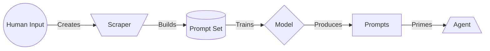

# GPT Tools
This is a set of typescript tools that interact with OpenAI's ChatGPT models.

## Setup
Clone?? npm install???

To use these tools, you will need to create a .env file to contain your API Key, like so:

.env:

        API_KEY=[API KEY]

## Tools

#### GPTClient
The GPT Client is the container class for the tool set. This contains all the functions.

        const client = new GPTClient()

## Functions

#### Single Prompt
This function takes a single prompt as a string, optionally directed at a specific model, optionally at a specific temperature. The prompt is not given any context outside of the model, and the request is coming from the User.

		async singlePrompt(message: string): Promise<string>

#### Continue Conversation
This function takes an existing set of messages and prompts the given model for a response with the message history as the context.

		async  continueConversation(messages: Array<ChatMessage>, model?: string, temperature?: number): Promise<string>

#### Create Agent
This function takes a prompt for an agent, optionally given a specific model and temperature

		async  createAgent(agent: Agent, model?: string, conversation?: Array<ChatMessage>): Promise<string>

The `Agent` class can be extended to 

#### Create Pre-Trained Model
This function takes in a file path of a dataset and prepares a pre-trained model from the input data, given an optional base model, and returns the ID of the new model, as a string. 

        async createPTM(filePath: string): string

## Models
A prompt generator is a PTM that generates prompts for other models:
