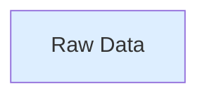
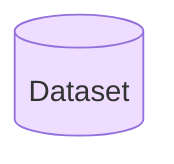
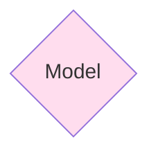
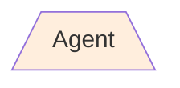
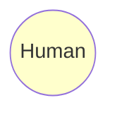
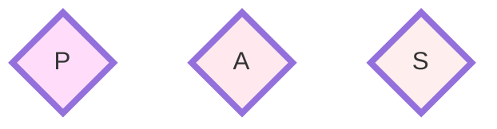
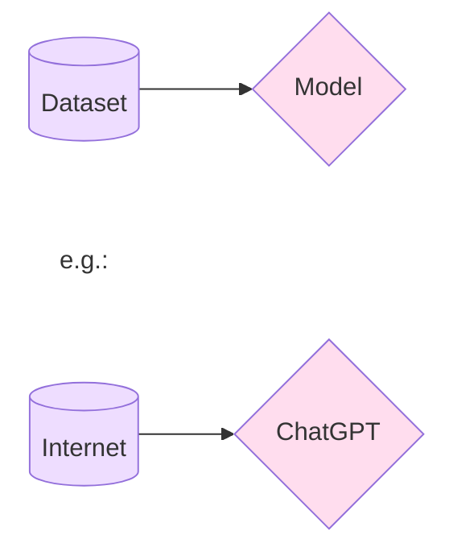
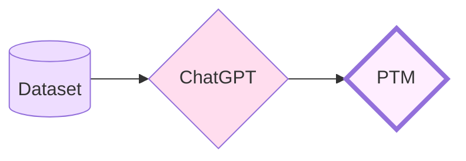
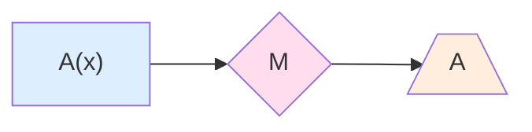
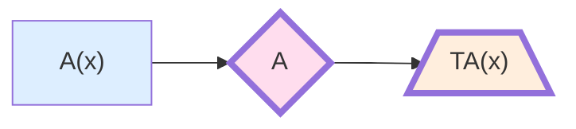

# GPT Tools

This is a ChatGPT client that contains a set of JavaScript tools that interact with OpenAI's ChatGPT models.

Contact me here: [withtorr@gmail.com](mailto:withtorr@gmail.com)

Or check out my video content here, where I discuss game development, programming, science, and technology:

[WithTorr - YouTube](https://www.youtube.com/@withtorr)

Or watch me stream - C#/Unity, Game development, and some good old fashioned gameplay

[WithTorr on Twitch](https://www.twitch.tv/withtorr)

## Setup

To obtain your API key, create an account at [OpenAI.com](https://platform.openai.com/signup)

Create your key in the [API Keys](https://platform.openai.com/account/api-keys) section

**MAKE SURE TO COPY YOUR KEY as you won't get another chance to look at it!**

Install this package in your project via npm or yarn:

    npm install gpt-tools

<!-- - -->

    yarn add gpt-tools

To use this client, you will need to create a .env file to contain your API Key, like so:  
.env:

    OPENAI_API_KEY=YourApiKeyGoesHere

In a React application, you can set it with the REACT_APP prefix

    REACT_APP_OPENAI_API_KEY=YourApiKeyGoesHere

If you're using Vite, you'll want to use the VITE prefix:

    VITE_OPENAI_API_KEY=YourApiKeyGoesHere

You can import models and the GPT client from the package like so:

    import GPTClient from 'gpt-tools';
    import { ChatMessage, ChatResponse } from 'gpt-tools/dist/gpt-models.js';

## Example Usage:

[Coming soon...]

## Tools

#### GPTClient

The GPT Client is the container class for the tool set. This contains all the functions. Create an instance of the client using your OpenAI API key.

    const apiKey = process.env.REACT_APP_API_KEY;
    const client = new GPTClient(apiKey);

## Functions

### Chatroom Functions

#### Add System Message

Add a message to the chat with the role of System

    addSystemMessage(message: string)

#### Add Host Message

Add a message to the chat with the role of User

    addHostMessage(message: string)

#### Add Message

Add a message to the chat with the given role and new participant name

    addMessage(message: string, role: Role, name: string, setupPrompt?: string, introPrompt?: string, temperature?: number)

#### Add Message For

Add a message to the chat directed towards a particlar participant

    addMessageFor(message: string, participant: ChatAgent, role?: Role)

#### Add System Message For

Prompt a particular participant for a response

    addSystemMessageFor(message: string, participant: ChatAgent)

#### Get Conversation

Get the current chatroom conversation history

    getConversation(): Array<ChatroomMessage>

#### Get Conversation Messages

Get the chatroom history as an array of chat messages only

-   Names may be included in the message content, since different participant messages are not differentiated otherwise

    getConversationMessages(includeNames?: boolean): Array<ChatMessage>

Empty the chatroom conversation history

    clearChat()

### Participant (Agent) Methods

#### Add Participant

Add a new participant to the chatroom
Participants must have a unique name and a setup prompt that defines the participant.

    addParticipant(name: string, setupPrompt: string, introPrompt?: string, temperature?: number)

#### Add Participant Agent

Add an existing chat agent to the chatroom

    addParticipantAgent(participant: ChatAgent)

#### Remove Participant

Remove a participant from chat with the given name, if they are in the chat

    removeParticipant(name: string)

#### Remove Participant Agent

Remove a participant from the chat

    removeParticipantAgent(participant: ChatAgent)

#### Is Participant In Chat?

Determine whether a participant with a particular name is currently in the chatroom

    isParticipantInChat(name: string): boolean

#### Get Setup Message

Get a participant's setup prompt, as a chat message

    getSetupMessage(participant: ChatAgent): ChatMessage

#### Get Setup Chatroom Message

Get a participant's setup prompt, as a system chatroom message

    getSetupChatroomMessage(participant: ChatAgent): ChatroomMessage

#### Get Intro Message

Get a participant's intro prompt, if it exists, as a system chat message

    getIntroMessage(participant: ChatAgent): ChatMessage

#### Does Participant Have Intro Message?

Determine if a participant has an intro message prompt

    doesParticipantHaveIntro(participant: ChatAgent): boolean

#### Get Intro Chatroom Message

Get a participant's intro prompt, if it exists, as a system chatroom message

    getIntroChatroomMessage(participant: ChatAgent): ChatroomMessage

#### Get Participants

Get all current participants in the chat

    getParticipants(): Array<ChatAgent>

#### Clear Participants

Clear out the list of participants

    clearParticipants()

### Prompt Methods

#### Prompt Participant

Prompt a particular participant in the chat for a response

    promptParticipant(participant: ChatAgent)

#### Prompt All Participants

Prompt a response from every participant

    promptAllParticipants()

#### Introduce Participant

Introduce a participant - add their intro message and prompt a response

    introduceParticipant(participant: ChatAgent)

### Basic Helper Methods

#### Continue Chat

Take in a set of Chatroom messages and prompt a particular participant to continue the chat

    async continueChat(messages: Array<ChatroomMessage>, participant: ChatAgent): Promise<ChatroomMessage>

#### Continue Conversation Full

Return the entire response body of a conversation completion request

    async continueConversationFull(messages: Array<ChatMessage>, model?: string, temperature?: number): Promise<ChatResponseBody>

#### Continue Conversation

Return just the first response from a conversation completion request

    async continueConversation(messages: Array<ChatMessage>, model?: string, temperature?: number): Promise<string>

#### Single Prompt

A simple one-time text prompt that returns a the first response content

    async singlePrompt(message: string, model?: string, temperature?: number): Promise<string>

#### Single Prompt Full

A one-time text prompt that returns the entire response body

    async singlePromptFull(message: string, model?: string, temperature?: number): Promise<ChatResponseBody>

### PTM (Pre-Trained Model) Helper Methods

Returns the command necessary to create a pre-trained model given a local path to a file the contains the necessary training data

    createPTM(filePath: string): string

### Single Chat Methods

#### Reply To Conversation

Prompt the default model for a response to a conversation with a new message added

    async replyToConversation(messages: Array<ChatMessage>, nextMessage: string): Promise<string>

#### Reply To Conversation Full

Prompt the default model for a response to a conversation given a next user message

    async replyToConversationFull(messages: Array<ChatMessage>, nextMessage: string): Promise<ChatResponseBody>

#### Create Agent

Prompt single chat agent for a response given a conversation

    async createAgent(agent: Agent, model?: string, conversation?: Array<ChatMessage>, temperature?: number): Promise<string>

#### Chat Message Roles

Roles

-   system
-   user
-   assistant
-   function

### ChatGPT Request Models

#### ChatRequestBody

The body of the request required by the OpenAI API documentation
// The conversation to which the model is supposed to reply
messages: Array<ChatMessage>
// The specific GPT model being targeted
model?: string
// The maximum number of tokens allowed for this completion
max_tokens?: number
// Temperature or randomness of the response (0.0 - 2.0)
temperature?: number

#### ChatResponseBody

The body of the response as given in the OpenAI API documentation
// The ID of this particular response (set)
id?: string
// Generally, "chat.completion" - the type of completion object
// This can be different for function requests
object?: string
// The date and time the response was generated
created?: number
// The GPT model used
model?: string
// The responses generated
// (the same request can be submitted multiple times to generate multiple responses)
choices?: Array<ChatResponse>
// The number of tokens used in the prompt and the response
usage?: Usage

#### ChatMessage

The basic chat message model used in requests and responses
// The origin of this message
role: Role
// The text content of a prompt or a response
content: string

#### ChatResponse

A specific conversation completion, an item in the Choices array that
// is part of the completion Response Body object
export class ChatResponse {
// The index of this particular response
index?: number
// The actual response message
message?: ChatMessage
// The reason this response was completed - finished, error, or token limit reached, etc.
finish_reason?: string

#### Usage

A record of the number of tokens used in a completion request
export class Usage {
// The number of tokens in the prompt
prompt_tokens?: number
// The number of tokens in the response
completion_tokens?: number
// The sum of these two numbers
total_tokens?: number

### Dataset preparation/PTM generation models

#### Dataset

Used to train a model to create a PTM
// A set of ideal prompt/response pairs
data: Array<IdealPrompt>

#### IdealPrompt

A single training datum - a prompt and response
// A prompt intended for the PTM
prompt: string
// An ideal response from the PTM this data is intended to train
completion: string

### Simple Chat Models

#### ChatAgent

A primed agent meant to take part in a conversation
// The name of the participant - this must me unique and serves as their ID
name: string
// The system prompt given to a chat agent that creates and identifies the agent
// - Added to the beginning of the conversation when prompted for a response
// - Always appears first, and only for this particular agent
setupPrompt: string
// The system prompt given to a chat agent only once, when introduced.
// This message is added to the conversation
introPrompt?: string
// The randomness of this agent (0.0 - 2.0)
temperature?: number
// Whether or not the participant has been introduced - the intro prompt should only be used once
wasIntroduced: boolean = false
getSetupPrompt()

#### ChatroomMessage

A message that's part of a chat between one or more agents and a user/host
// The message itself
message: ChatMessage
// The agent from whom this message originates (can be System or Host as well as a participant)
speaker: ChatAgent

#### Agent

Intended to be a single-use agent, not part of a multi-agent chat.
Can be extended, and the getSystemPrompt method can be overridden
name?: string
role?: string
task?: string
format?: string
restrictions?: string
getSystemPrompt()

### Simple Prompt Functions

#### Single Prompt

This function takes a single prompt as a string, optionally directed at a specific model, optionally at a specific temperature. The prompt is not given any context outside of the model, and the request is coming from the User.

    async singlePrompt(message: string): Promise<string>

#### Continue Conversation

This function takes an existing set of messages and prompts the given model for a response with the message history as the context.

    async continueConversation(messages: Array<ChatMessage>, model?: string, temperature?: number): Promise<string>

A `ChatMessage` is a prompt to or response from the model. Together, a list of `ChatMessages` makes a conversation. A conversation history can be given to a model to provide context for a response. A chat message has a role (System, User, Assistant, or Function), and some content (a string). The roles a message can have are:

-   user - The user prompting the model
-   assistant - The model's response
-   system - Contextual information given to the model
-   function_call - Some models have built-in functions. This will call a particular function.

#### Create Agent

This function takes a prompt for an agent, optionally given a specific model and temperature

    async createAgent(agent: Agent, model?: string, conversation?: Array<ChatMessage>, temperature?: number): Promise<string>

By default, an Agent has the (string) properties:

-   Name
-   Role
-   Task
-   Format
-   Restrictions

These properties are used to build a system prompt that prepares an `Agent`. This is done with the `getSystemPrompt` function.

The `Agent` class can be extended to add properties or modify the `getSystemPrompt` function.

Creating an Agent also comes with the option of specifying a model, including an existing conversation, and applying a temperature.

#### Create Pre-Trained Model

This function returns the npm command necessary to create a new model from the OpenAI CLI.

    async createPTM(filePath: string): string

Add this script to your `package.json` to use the command from a server-side application:

    "scripts":{
        "train-model": "openai tools fine_tunes.prepare_data -f $npm_config_file",
        ...
    }

## Terms

#### Raw Data

This is any collection of data that has not been formatted into prompts and responses.

#### Dataset

This is a collection of data that has been formatted for use with GPT models

#### Model

This is a base, "vanilla" GPT model (not a pre-trained model)

[OpenAI Models](https://platform.openai.com/docs/models/overview)

#### Agent

This is a prepared conversation in which the model has been provided with a role via a system prompt, and possibly an existing conversation history.

#### Human

All model interaction has to be prompted and moderated by humans, since models can make mistakes and produce garbage data. Human curation and model refinement can help decrease the frequency of mistakes, but it will never go to 0.

#### Flavor

Flavor refers to the purpose or format of a dataset, and/or a pre-trained model based on such a dataset. A model can be trained, for instance, to generate Agent data, or to generate sets of prompts for creating other models based on variable parameters, or to emulate a particular style of writing.
Examples:

-   Prompt Generator
-   Agent Generator
-   Style Emulator

## Interactions

#### Training

This is when a model is created using some set of training data. Once a model is created, it cannot "unlearn" a dataset, or be altered in any way. New models can, however, be created from this model, using new datasets. When a base model is combined with a specific flavor of data to create a new model for a specific purpose, this is called a pre-trained model.

Pre-Trained Model:

#### Agent Preparation

Agents are prepared by selecting a model, a setup, and an optional conversation history for context.

##### Trained Agent

Agent data is prepared to produce an agent given a specific Agent Generator model

## To Do

Extend to include other models besides ChatGPT  
Mode robust control of model parameters  
Refactor all model parameters into a ChatOptions model or ModelOptions model??# GPT Tools  
This is a ChatGPT client that contains a set of typescript tools that interact with OpenAI's ChatGPT models.
