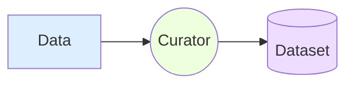
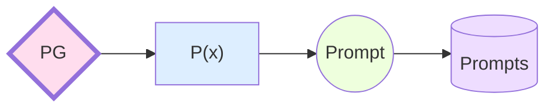

# GPT Tools

This is a ChatGPT client that contains a set of JavaScript tools that interact with OpenAI's ChatGPT models.

## Setup

Install this package in your npm project:

    npm install gpt-tools

To use this client, you will need to create a .env file to contain your API Key, like so:  
.env:

    API_KEY=[API KEY]

You can import models and the GPT client from the package like so:

    import GPTClient from 'gpt-tools';
    import { ChatMessage, ChatResponse } from 'gpt-tools/gpt-models';

## Example Usage:

[Coming soon...]

## Tools

#### GPTClient

The GPT Client is the container class for the tool set. This contains all the functions.

    const client = new GPTClient();

## Functions

#### Single Prompt

This function takes a single prompt as a string, optionally directed at a specific model, optionally at a specific temperature. The prompt is not given any context outside of the model, and the request is coming from the User.

    async singlePrompt(message: string): Promise<string>

#### Continue Conversation

This function takes an existing set of messages and prompts the given model for a response with the message history as the context.

    async continueConversation(messages: Array<ChatMessage>, model?: string, temperature?: number): Promise<string>

A `ChatMessage` is a prompt to or response from the model. Together, a list of `ChatMessages` makes a conversation. A conversation history can be given to a model to provide context for a response. A chat message has a role (System, User, Assistant, or Function), and some content (a string). The roles a message can have are:

- user - The user prompting the model
- assistant - The model's response
- system - Contextual information given to the model
- function_call - Some models have built-in functions. This will call a particular function.

#### Create Agent

This function takes a prompt for an agent, optionally given a specific model and temperature

    async createAgent(agent: Agent, model?: string, conversation?: Array<ChatMessage>, temperature?: number): Promise<string>

By default, an Agent has the (string) properties:

- Name
- Role
- Task
- Format
- Restrictions

These properties are used to build a system prompt that prepares an `Agent`. This is done with the `getSystemPrompt` function.

The `Agent` class can be extended to add properties or modify the `getSystemPrompt` function.

Creating an Agent also comes with the option of specifying a model, including an existing conversation, and applying a temperature.

#### Create Pre-Trained Model

This function returns the npm command necessary to create a new model from the OpenAI CLI.

    async createPTM(filePath: string): string

Add this script to your `package.json` to use the command from a server-side application:

    "scripts":{
        "train-model": "openai tools fine_tunes.prepare_data -f $npm_config_file",
        ...
    }

## Terms

#### Raw Data

This is any collection of data that has not been formatted into prompts and responses.

#### Dataset

This is a collection of data that has been formatted for use with GPT models

#### Model

This is a base, "vanilla" GPT model (not a pre-trained model)

[OpenAI Models](https://platform.openai.com/docs/models/overview)

#### Agent

This is a prepared conversation in which the model has been provided with a role via a system prompt, and possibly an existing conversation history.

#### Human

All model interaction has to be prompted and moderated by humans, since models can make mistakes and produce garbage data. Human curation and model refinement can help decrease the frequency of mistakes, but it will never go to 0.

#### Flavor

Flavor refers to the purpose or format of a dataset, and/or a pre-trained model based on such a dataset. A model can be trained, for instance, to generate Agent data, or to generate sets of prompts for creating other models based on variable parameters, or to emulate a particular style of writing.
Examples:

- Prompt Generator
- Agent Generator
- Style Emulator

## Interactions

#### Training

This is when a model is created using some set of training data. Once a model is created, it cannot "unlearn" a dataset, or be altered in any way. New models can, however, be created from this model, using new datasets. When a base model is combined with a specific flavor of data to create a new model for a specific purpose, this is called a pre-trained model.

Pre-Trained Model:

#### Agent Preparation

Agents are prepared by selecting a model, a setup, and an optional conversation history for context.

##### Trained Agent

Agent data is prepared to produce an agent given a specific Agent Generator model

##### Agent Generator

Agent data is prepared to produce an agent given a specific Agent Generator model

## Jobs

#### Prompt Engineer

Someone who works on refining prompt formation - syntax, content, etc.

#### Dataset Curator

Someone who looks through a large set of data and curates it towards creating prompts and ideal responses. Dataset curators need to know the specific Flavor of the Model or Agent is that their data is intended to produce.

e.g.:

##### Prompt Curator

## To Do

Extend to include other models besides ChatGPT  
Mode robust control of model parameters  
Refactor all model parameters into a ChatOptions model or ModelOptions model??# GPT Tools  
This is a ChatGPT client that contains a set of typescript tools that interact with OpenAI's ChatGPT models.
